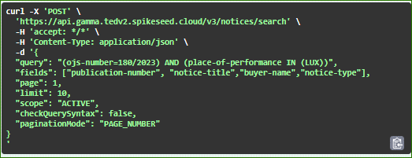
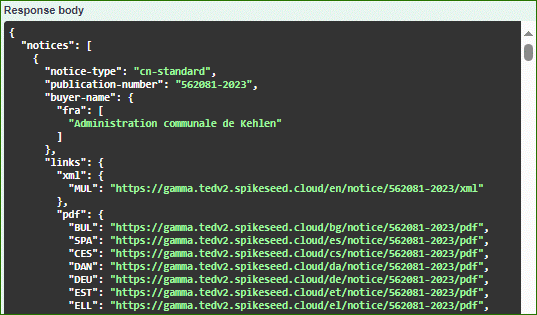
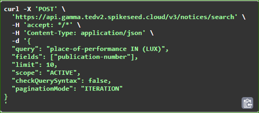
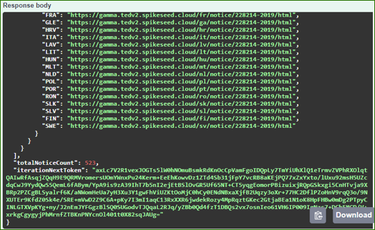

:doctitle: Search-API Demos

== Search mode: pagination

*Example:*
Find notices of the OJ S 18/2023 where the place of performance is Luxembourg; the result must contain the publication-number, the notice-title, the buyer-name and the form-type.

== Search mode: iteration

*Example:*
Find notices where the place of performance is Luxembourg; the result must contain the publication-number.

image::../images/demo5.png[]

