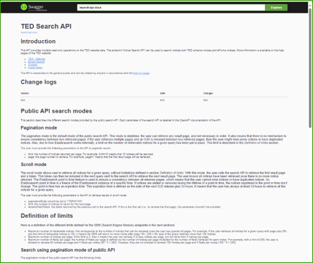
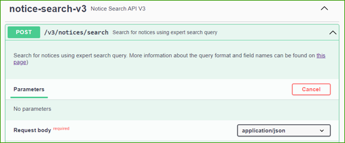

:doctitle: The Search API

Two options are available using the Search API:

*Swagger UI* - https://api.gamma.tedv2.spikeseed.cloud/swagger-ui/index.html

*Request URL* - https://api.gamma.tedv2.spikeseed.cloud/v3/notices/search

== Two Search modes available

The Search API offers two search modes:

=== Pagination mode, which allows the retrieval of up to 15000 notices for a given query, using pagination.

==== Limits:
* Maximum number of retrievable notices: 15k.
* Maximum number of notices per page: 250.
* Maximum number of fields per page: 10k.

If a limit is reached, the search API will return an error.

=== Iteration (scroll mode):

Allows the retrieval of all notices for a given query, without limitations. With this mode, the user calls the search API to retrieve the first result page and a token. This token can then be included in the next query sent to the search API to retrieve the next result page.

==== Limits:
* Maximum number of notices per page: 250.
* Maximum number of fields per page: 10k.

If a limit is reached, the search API will return an error. There is no limit on the number of retrievable notices

==== Request body of the notice search endpoint
* query: Expert search query to filter and sort notices
* fields: Fields to return for each notice
* page: Result page number, used to paginate results
* limit: Maximum number of returned notices, used to paginate results.
* scope: Search scope
* checkQuerySyntax: To check the syntax of the query.
* paginationMode: PAGE_NUMBER or ITERATION
* iterationNextToken: token returned by the previous call to the search endpoint to retrieve the next result page.

=== The Response File

The response file contains the total number of notices that match the search, and a list of the results.

Each result contains data of the fields specified in the request.

Each item contains the list of URLs for the various formats and languages in which the corresponding notice is available.

